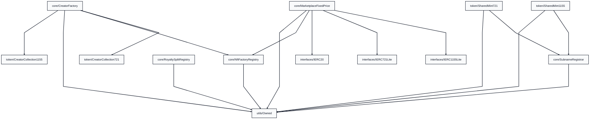

# Smart Contract Dependency Tree

Generated from Solidity imports in `packages/contracts/src`.

- Generated at (UTC): 2026-02-27 08:29:44
- Regenerate with: `bash scripts/generate-contract-dependency-tree.sh`

## Graph

### Internal Contract Graph

### External Library/Proxy Dependencies

```mermaid
%%{init: {'theme':'base','flowchart': {'rankSpacing': 240, 'nodeSpacing': 150, 'curve':'linear'}, 'themeVariables': {'fontSize':'18px'}}}%%
flowchart TB
  n1488782301["core/CreatorFactory"] --> n2464630231["@openzeppelin/contracts/proxy/ERC1967/ERC1967Proxy.sol"]
  n2181168441["token/CreatorCollection721"] --> n1164467089["@openzeppelin/contracts-upgradeable/token/common/ERC2981Upgradeable.sol"]
  n2181168441["token/CreatorCollection721"] --> n121531922["@openzeppelin/contracts-upgradeable/proxy/utils/Initializable.sol"]
  n2181168441["token/CreatorCollection721"] --> n194841614["@openzeppelin/contracts-upgradeable/access/OwnableUpgradeable.sol"]
  n2181168441["token/CreatorCollection721"] --> n2862567780["@openzeppelin/contracts-upgradeable/token/ERC721/extensions/ERC721URIStorageUpgradeable.sol"]
  n2181168441["token/CreatorCollection721"] --> n2992788007["@openzeppelin/contracts-upgradeable/proxy/utils/UUPSUpgradeable.sol"]
  n4278318399["token/CreatorCollection1155"] --> n1164467089["@openzeppelin/contracts-upgradeable/token/common/ERC2981Upgradeable.sol"]
  n4278318399["token/CreatorCollection1155"] --> n121531922["@openzeppelin/contracts-upgradeable/proxy/utils/Initializable.sol"]
  n4278318399["token/CreatorCollection1155"] --> n194841614["@openzeppelin/contracts-upgradeable/access/OwnableUpgradeable.sol"]
  n4278318399["token/CreatorCollection1155"] --> n2992788007["@openzeppelin/contracts-upgradeable/proxy/utils/UUPSUpgradeable.sol"]
  n4278318399["token/CreatorCollection1155"] --> n788199328["@openzeppelin/contracts-upgradeable/token/ERC1155/ERC1155Upgradeable.sol"]
  classDef default fill:#fff7ed,stroke:#9a3412,stroke-width:2px,color:#7c2d12,font-size:16px;
  linkStyle default stroke:#9a3412,stroke-width:2.5px;
```

## Contracts and Direct Imports

### `utils/Owned.sol`
- _(no imports)_

### `core/CreatorFactory.sol`
- `@openzeppelin/contracts/proxy/ERC1967/ERC1967Proxy.sol`
- `core/NftFactoryRegistry`
- `token/CreatorCollection1155`
- `token/CreatorCollection721`
- `utils/Owned`

### `core/NftFactoryRegistry.sol`
- `utils/Owned`

### `core/MarketplaceFixedPrice.sol`
- `core/NftFactoryRegistry`
- `interfaces/IERC1155Lite`
- `interfaces/IERC20`
- `interfaces/IERC721Lite`
- `utils/Owned`

### `token/SharedMint1155.sol`
- `core/SubnameRegistrar`
- `utils/Owned`

### `interfaces/IERC1155Lite.sol`
- _(no imports)_

### `token/CreatorCollection1155.sol`
- `@openzeppelin/contracts-upgradeable/access/OwnableUpgradeable.sol`
- `@openzeppelin/contracts-upgradeable/proxy/utils/Initializable.sol`
- `@openzeppelin/contracts-upgradeable/proxy/utils/UUPSUpgradeable.sol`
- `@openzeppelin/contracts-upgradeable/token/ERC1155/ERC1155Upgradeable.sol`
- `@openzeppelin/contracts-upgradeable/token/common/ERC2981Upgradeable.sol`

### `token/CreatorCollection721.sol`
- `@openzeppelin/contracts-upgradeable/access/OwnableUpgradeable.sol`
- `@openzeppelin/contracts-upgradeable/proxy/utils/Initializable.sol`
- `@openzeppelin/contracts-upgradeable/proxy/utils/UUPSUpgradeable.sol`
- `@openzeppelin/contracts-upgradeable/token/ERC721/extensions/ERC721URIStorageUpgradeable.sol`
- `@openzeppelin/contracts-upgradeable/token/common/ERC2981Upgradeable.sol`

### `token/SharedMint721.sol`
- `core/SubnameRegistrar`
- `utils/Owned`

### `core/RoyaltySplitRegistry.sol`
- `utils/Owned`

### `interfaces/IERC20.sol`
- _(no imports)_

### `interfaces/IERC721Lite.sol`
- _(no imports)_

### `core/SubnameRegistrar.sol`
- `utils/Owned`

