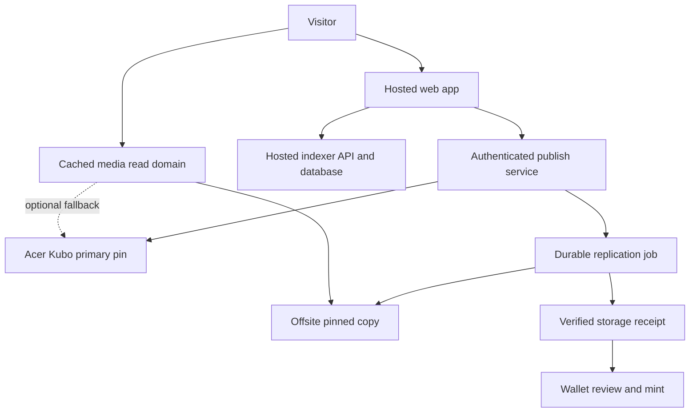

# NFTFactory product refresh and reliability plan

Date: 11 September 2026. Status: reviewed proposal, ready to turn into implementation work. This review changes documentation only; dependencies, application behavior, contracts, hosts, public routing, and publication remain unchanged.

## Recommendation

Focus NFTFactory on one useful promise: **publish artwork, mint an NFT, and share a clear creator page**. Keep the local Acer IPFS node as an owned primary copy, add an offsite pinned copy, and deliver published content through a cached read service. Keep the application and its essential read database outside the home's failure domain.

For the first release, let existing pages and media remain readable during a home outage, while new publishing pauses with a saved draft. This is substantially simpler than making every write path automatically fail over. Add uninterrupted offsite publishing later only if measured demand justifies it.

## Evidence and review limits

Reviewed the product draft, roadmap, architecture, contracts documentation, deployment/IPFS runbooks, app routes, global styles, wallet configuration, publishing clients, gateway, indexer authorization, and dependency policy. Ran fresh npm audit/outdated queries and checked current vendor documentation. Inspected the existing local production build in a browser: home, mint, discover, profile setup, and moderation, including a 390px mobile viewport and a desktop viewport. Public-profile customization and owner tools were reviewed in source; a populated, connected-wallet profile was not visually validated.

The live site could not be opened by the browser tool. The local build used recorded Sepolia configuration and intentionally unavailable backends; its outage messages are local observations, not evidence of today's production outage. It is a prior build, not a newly built release candidate. No real wallet signing, mainnet operations, live uploads, infrastructure tests, fresh full test suite, or formal contract security audit were performed in this review. Earlier passing tests remain historical evidence.

The provisioning handoff reports Kubo 0.43.0 and both Acer services active after reboot, ports 5001/8788/8080 on loopback, 91 peers, 72,211 bytes repository size, a 10,000,000,000-byte storage ceiling, and zero objects. Persistent NFTFactory content and public origins remain unvalidated. See [Acer integration status](./Acer-IPFS-Integration.md).

Fresh machine-readable evidence is in `docs/reviews/2026-09-11/`: npm-audit.json, npm-audit-production.json, and npm-outdated.json. These are dependency findings, not proof that every advisory is exploitable in the deployed application.

## 1. Simplify the product boundary

The repository currently combines a minting studio, contract deployment/upgrade console, marketplace, ENS identity manager, customizable social profile builder, moderation console, and infrastructure dashboard. The main simplification is reducing the number of decisions before first value.

| Keep prominent for the first release | Move into creator settings/advanced tools | Defer from the first-release experience |
| --- | --- | --- |
| Upload artwork, name, description, preview | Creator-owned collections and contract details | New chains and additional contract families |
| One-of-one shared mint as the default | Editions for creators who need them | Guestbook/social expansion, top friends, profile songs |
| Shareable creator page and collection inventory | ENS linking, collection verification, royalties | Arbitrary profile HTML/CSS editing and multiple presentation engines |
| Browse artwork without connecting a wallet | Ownership transfer/finalization with clear review | Custom payment-token onboarding and complex marketplace modes |
| Clear transaction and storage receipts | Existing listing tools for supported assets | Self-hosted chain RPC as a prerequisite for this product |

Retain existing advanced code and assets during migration; hiding or feature-gating a capability is not deleting contracts or user content. Shared publishing already involves registry/royalty/moderation dependencies: a simpler UI does not by itself allow removing those contracts. Trace deployment wiring before reducing the contract suite. Avoid migrating existing NFTs just to simplify the application.

Make ENS optional at onboarding. A connected wallet and a readable creator page should provide first value before the user chooses among five naming actions. Default copy should say “Create an NFT” and “Your work.” Explain shared ownership boundaries accurately: token ownership is not the same as controlling a collection contract.

Keep marketplace sale capabilities out of the critical publish path. If a marketplace launch is retained, it needs its own acceptance gate for approvals, prices, listings, settlement, and stale data. Do not present “sell anywhere” or guaranteed permanence as an implemented promise.

## 2. Design review and proposed direction

The cream/peach palette, orange accents, dark text, rounded cards, and shared card components give the site a recognizable character. Keep that identity. Reduce repeated bordered panels, technical prose, and multiple competing calls to action. Put artwork and the creator's result ahead of implementation details.

| Surface | Finding from rendered interface or source | Recommended change |
| --- | --- | --- |
| Home | Long hero about collection/storefront/identity, then repeated capability blocks and nine route cards. Operator and support links have similar prominence to creation. | One short promise, primary Create CTA, secondary Explore CTA, artwork/creator examples, three-step explanation, brief ownership/storage explanation, compact support footer. |
| Navigation | Home/Mint/Discover/Profile/Wiki plus wallet and long tagline. On mobile these become a tall vertical stack. | Logo, Explore, Create, My studio; Help in footer/menu. Compact mobile header and menu. Connect only when an action requires it. |
| Global status | Every page mounts a 60-second health poll and can display raw environment names, tunnel instructions, and operator links. | Cached service status; one contextual user sentence. Keep detailed diagnostics on an operator page. Never turn an upload outage into a giant browsing obstruction. |
| Mint | Five numbered sections, repeated wallet/network/status panels, token/collection choices, and Mint/View/Manage modes. | Three stages: Artwork → Details and preview → Review and mint. Shared one-of-one default, advanced collection choices collapsed. Connect at review; preserve draft before wallet interaction. |
| Discover | Large explanation and zero counters above results; default Profiles view; collection cards derived from the loaded mint feed. | Artwork-first cards, compact search/filter bar, creator and collection tabs second. Distinguish unavailable index from a truly empty result. Server-backed collection/search data rather than presenting a partial loaded feed as the whole catalog. |
| Profile setup | Five naming actions and reversed ENS route guidance shown before first value. | Name/avatar/bio first, optional ENS link later. Hide internal routing rules. Show what will be public before saving. |
| Public profile | Source mixes public display, owner controls, debugging, snapshots, wallet linking, HTML/CSS, songs, and retro modules. | Artwork grid, creator identity, concise bio, collections, clear ownership badges. Separate Edit page for the owner. Start with one polished template. |
| Moderation | Manual profile-name and actor-wallet fields plus a queue loader. | Open in context from an owned profile; authenticated role is derived from session. Clear empty/loading/error states and recorded actions. |
| Wiki/help | Operator runbooks in primary navigation; product support still has placeholders. | Short creator help plus support/status links. Keep runbooks available to operators in a separate area. |

### Visual and accessibility specifics

- At 390px, the local mint page had a 491px document width. The health banner's long technical strings were among the overflowing elements. Add safe text wrapping and shrinkable grid/flex children, and verify no horizontal scrolling at 320/390/768/1440px.
- The mobile navigation consumed roughly the first 400px before the outage banner. The user should see the task title and first useful action in the initial viewport.
- White on the declared orange `#ff5a36` is approximately 3.10:1 contrast. Use a darker button background or dark label for normal-size text. WCAG's normal-text target is 4.5:1; this is a palette calculation, not a full accessibility certification. [W3C contrast guidance](https://www.w3.org/WAI/WCAG22/Understanding/contrast-minimum.html)
- Home has an h1; observed app pages begin at h2/h3. Give each page a meaningful h1 and a consistent hierarchy. Verify visible keyboard focus, labeled inputs, usable error summaries, and wallet-modal focus handling.
- Use content-sized headings. The long home/discover headings create heavy multi-line blocks. Replace internal labels such as “collection target,” “actor wallet,” and “indexer” with user outcomes.
- Preserve image dimensions/aspect ratios while loading; use generated thumbnails for grids, originals on demand, and useful alt text. Do not fetch full 25 MB assets for a card preview.
- Keep motion optional and respect reduced-motion preferences, especially if retro modules survive in advanced profiles.
- Show distinct states: Uploading → Securing copies → Ready to mint → Waiting for wallet → Confirming → Published. Retrying a read or replication job must not trigger a second mint.

Suggested home composition: compact navigation; “Publish your artwork. Make it collectible.”; Create an NFT / Explore artwork; a real example grid; Upload, Preview, Mint; a short explanation of creator control and replicated storage; Help / Status / About footer. Example artworks must be real authorized examples or clearly labeled demo content.

## 3. Dependency and code review

The full fresh audit reports **31 affected package entries: 1 critical, 3 high, 27 moderate**. This supersedes the August count of 24 total / 2 high. Counts include transitive reporting and development dependencies. The production-only audit reports **29 entries: 1 critical, 3 high, 25 moderate** and is saved separately.

| Area | Current evidence | Recommendation |
| --- | --- | --- |
| Next.js | Locked 16.3.2; current npm stable query returns 16.3.4. Critical advisory includes AVIF image optimization; separate Windows-hosted advisory has platform-specific applicability. | Update to a patched 16.3.x release, validate image handling and production build. Assess deployed reachability separately; do not claim a demonstrated compromise. |
| Sharp | Locked 0.35.3; audit flags versions below 0.35.4. | Resolve a patched compatible image stack with Next, inspect the resulting lockfile, test hostile/invalid image rejection. |
| Axios | Root override says 1.19.0, but lockfile root entry is 1.16.0. | Reconcile manifest/lock/install state and inspect actual dependency paths. An override declaration is not evidence that a patch took effect. |
| Wallet stack | RainbowKit 2.2.11 peers on Wagmi ^2.9.0; app uses Wagmi 2.19.5. Nested WalletConnect/Reown ws includes 8.18.0 despite root ws 8.21.3. | Prototype Wagmi 3 with a small explicit connector selection; replace RainbowKit only with a reviewed wallet UI. Test injected and required mobile wallets before adopting. |
| TypeScript | 5.7.3; queried Wagmi 3.7.7 peer requires >=5.9.3. | Upgrade with wallet migration as a coherent compatibility change. |
| Vitest | 3.2.6 in workspaces; new mocker-related moderate advisories, audit suggests 4.1.11. | Upgrade the test toolchain separately and rerun scripts/web/indexer tests. Do not mix unrelated tool migrations into a contract change. |
| React / Query / Viem | Already useful shared infrastructure; several newer compatible/minor versions available. | Keep; update in tested batches. Removing Query or Viem would create more custom state/network code. |
| Prisma / Postgres | Prisma/client 6.4.1; newer majors exist. | Keep the database architecture. Upgrade Prisma/client together only after migration/backup/restore tests. Do not chase a prerelease tag: the queried prisma latest tag returned 8.0.0-rc.13 while client latest returned 7.10.0. |
| OpenZeppelin | 5.4.0 checked dependencies; newer 5.6.1 available. | Review changelogs, storage layout, deployment impact, and contract tests in a dedicated change. Do not upgrade deployed contract logic merely to make npm outdated empty. |
| Lint | Web script still runs `next lint`. | Replace with the supported ESLint CLI/config for the selected Next version and add to validation. |

The current audit policy already blocks every high/critical and unexpected advisory; preserve that behavior. Reduce the known-moderate allowlist as migrations land, with named owners and expiry dates. Do not use `npm audit --force` as the migration plan.

Primary sources: [Next security advisory](https://github.com/vercel/next.js/security/advisories/GHSA-2xp9-vwfh-vxw4), [Wagmi v3 migration](https://wagmi.sh/react/guides/migrate-from-v2-to-v3), [RainbowKit installation](https://rainbowkit.com/en-US/docs/installation). Package-specific versions/peers above were read from npm during this review; they are a dated snapshot, not automatic upgrade instructions.

### Simplify code without a rewrite

`MintClient.tsx` is 4,839 lines, `ProfileClient.tsx` 3,424, and `services/indexer/src/indexer.ts` 9,067. Split by responsibility while implementing the selected flows: upload/replication state, mint transaction state, collection settings, public presentation, authenticated editing, indexer routes, chain ingestion, and persistence. Keep one shared IPFS transport/configuration implementation; web upload routes and scripts currently repeat URL/auth/retry behavior.

Move wallet setup out of the global dependency path where feasible so Home and Explore do not require every contract address merely to render. Keep one validated deployment manifest instead of duplicated mainnet/Sepolia assumptions spread through code and documents.

Security finding requiring a targeted follow-up: `assertAdminRequest` accepts an allowlisted `x-admin-address` or payload actor; a token is enforced only when one is configured. An address supplied by a client is not proof of wallet control. Require token authentication for operational endpoints or a verified nonce-bound wallet session plus role checks. The review has not established that an unprotected admin endpoint is deployed. Also audit creator mutations and upload authorization: a hidden server IPFS token plus best-effort per-IP throttling does not establish the caller's right to consume storage.

## 4. Local IPFS, latency, and redundancy

### Separate the kinds of data

| Data | Durable home | Serving strategy |
| --- | --- | --- |
| Published original media and metadata | Acer pin + offsite pin with same CID | Independent read gateway behind CDN/cache |
| Thumbnails/derivatives | Regenerable, preferably replicated | CDN, versioned immutable URLs |
| Ownership and transaction truth | Blockchain | RPC reads; revalidate before transactions |
| Discovery, profiles, moderation, upload jobs | PostgreSQL with backups | Hosted API; bounded cached reads |
| Unpublished drafts | Private draft storage/browser with clear limitations | Never silently publish private drafts to IPFS |
| Website code | Git + deployment artifacts | Hosted Next application; optional static IPFS archive later |

IPFS does not replace PostgreSQL or execute the existing Next API handlers. A full static-IPFS app requires moving dynamic routes/auth/server operations elsewhere, which increases migration scope. Keep Next hosting now; optionally archive versioned static marketing pages and public profile snapshots. [Next static export limits](https://nextjs.org/docs/app/guides/static-exports)

### Recommended first-release topology

This is a proposed topology. Offsite pinning, replication jobs, storage receipts, CDN routing, and hosted indexer placement have not been implemented by this review.

Use a single offsite pinning provider with a dependable content gateway for the lowest operational burden. If ownership of both nodes matters more than maintenance, use a small offsite VPS running Kubo. Either must have power/network independent of home. A second home machine or second tunnel to the same home connection does not cover a home outage. Start without IPFS Cluster; a CID inventory, durable jobs, and reconciliation suffice for two copies.

A CDN cache is a performance layer, not the second durable copy. Multiple public gateway URLs also do not prove replication. IPFS documentation recommends pinning to multiple nodes, gateway caching, and monitoring connectivity. [IPFS persistence](https://docs.ipfs.tech/concepts/persistence/) · [Gateway practices](https://docs.ipfs.tech/how-to/gateway-best-practices/)

After add: record the content and metadata CIDs, recursively pin the complete content graph offsite, wait for completion, and verify retrieval from that independent service. Protect against a false verification where a public gateway simply fetches from Acer: during the acceptance drill, verify retrieval with the home route unavailable. Store status and retry timestamps in a durable job table. Reconcile the published CID set periodically; never treat “pin request accepted” as “pinned.”

Require both local and offsite confirmation before enabling a new mint in v1. This deliberately pauses new publication if either copy cannot be confirmed. Existing published assets remain served offsite. If continuous publishing during home outages later becomes essential, add durable offsite upload staging and a documented temporary replication policy rather than pretending one copy is two.

### Upload-path correction

The existing metadata route accepts a 48 MiB request and individual 15 MiB images / 25 MiB audio, but Vercel Functions document a 4.5 MB request/response limit. The Acer gateway's 32 MiB limit cannot fix rejection before the request reaches Acer. [Vercel limits](https://vercel.com/docs/functions/limitations)

For the simplest image-first beta, cap the **entire multipart request** below 4.5 MB, e.g. 3 MiB, with visible validation and thumbnail/preview handling. If preserving full-resolution originals or audio above that limit is required for launch, implement a separate upload service reached directly with short-lived, single-use capabilities bound to authenticated user, byte limit, expiry, and permitted media. Keep the long-lived gateway Bearer token exclusively server-side. The current gateway does not implement this browser capability protocol; never put its static token in the client. Use resumable uploads when real file sizes warrant them.

### Latency targets and measurements

No live latency baseline has been measured. Proposed acceptance targets, not promises: cached thumbnails p95 <500ms to first byte from target user regions; uncached metadata p95 <2s through the offsite service; image grids use thumbnails; transient origin failure produces a useful retry/draft state within 10s. Measure upload duration separately from replication completion and blockchain confirmation.

Benchmark small JSON, a thumbnail, a 3 MiB image, and any retained maximum-size original/audio. Measure cold and warm cache, Portugal/Europe and a second target region, home online/offline, concurrent uploads, and home AI-model load. As a capacity example only, 25 MB over a 10 Mbps home upstream takes at least about 20 seconds before protocol overhead; concurrency increases contention. Locality to the owner does not imply low latency to visitors.

Cache immutable CID responses with appropriate cache headers, retain canonical `ipfs://` identifiers, and use a controlled read domain so origins can change without reminting. For active HTML/site content prefer per-CID subdomain isolation. Metadata and media delivery must never expose RPC or home files. Give Kubo/gateway CPU, memory, disk, and network budgets so model downloads/inference do not starve publishing.

### Outage behavior and recovery

| Failure | Required behavior |
| --- | --- |
| Home power/router/ISP outage | Hosted site, database-backed browsing, and offsite media remain available; publishing waits with draft preserved. |
| Acer down but home online | Same; alert operator, restore pins/service, reconcile. |
| Offsite provider unavailable | Serve verified local content where reachable; cache may help. Pause new mint until the two-copy policy can be satisfied. |
| Indexer unavailable | Cached public pages show freshness; no false zero inventory. Chain actions revalidate independently or are unavailable with a clear reason. |
| One RPC unavailable | Use configured independent RPC fallback; no blind transaction rebroadcast. |
| CDN or DNS provider outage | May still affect access; document direct alternate read endpoint. Full multi-CDN is deferred complexity. |

Proposed recovery objectives: no loss of already accepted published content after a single-node failure; offsite database backups at least hourly with a <=1h target RPO and <=4h restore target, subject to a tested restore. Backups are separate from redundant serving copies. Keep a CID manifest and encrypted database backups; record which data cannot be rebuilt from chain. Add disk-watermark alerts and capacity forecasts before raising the current 10GB ceiling. Alerting must run outside the home network to detect its failure.

## 5. Ordered implementation recommendations

Effort bands are planning estimates for focused work, not delivery commitments: S = roughly 1–2 engineering days, M = 3–5, L = 1–2 weeks. Infrastructure access and external approvals can extend elapsed time.

| Order | Work and owner role | Effort | Completion evidence |
| --- | --- | --- | --- |
| 1 | Patch Next/Sharp and reconcile Axios/ws lockfile; audit privileged endpoint authentication (engineering/security). | M | Clean relevant high/critical audit results; production build; negative authorization tests; no lockfile override mismatch. |
| 2 | Agree image-first publish/share scope, optional ENS, advanced collection tools, and paused writes during home outages (product). | S | One creator journey, explicit supported wallet/media/chain list, one current roadmap. |
| 3 | Add offsite pins and protected read/write origins; keep web/API/DB outside home failure domain (operations). | M | Same published fixture available with home disconnected; private RPC remains private. |
| 4 | Implement upload sizing or scoped direct-upload service, durable replication receipt, and pre-mint availability gate (engineering). | M–L | Size-boundary tests, no browser secret, retry-safe upload, mint disabled until required copies verified. |
| 5 | Refresh navigation, home, Create flow, status/errors, and mobile layout (design/frontend). | M–L | 320–1440px checks, no overflow, accessible actions, one clear primary action, saved draft and transaction receipt. |
| 6 | Simplify wallet stack and update TypeScript/test dependencies in a separate change (frontend). | M–L | Required extension/mobile wallets pass connect, reject, switch, sign, disconnect/reconnect tests; smaller measured bundle/dependency tree. |
| 7 | Simplify creator profile/discovery and separate advanced/operator tools (frontend/backend). | M | Profile visible without ENS setup, real indexed search/pagination, unavailable vs empty states, owner-only editing. |
| 8 | Split oversized modules and consolidate config/IPFS clients while preserving behavior (engineering). | M–L, incremental | Focused regression tests and one authoritative deployment/config source. |
| 9 | Run performance, outage, backup/restore, and Sepolia acceptance drills (QA/operations). | M | Recorded timing, content read during home outage, replication recovery, wallet receipts, indexed visibility, successful restore. |
| 10 | Review contracts, publish truthful support/storage policies, then decide launch readiness (release owner). | Depends on findings | Contract verification and ownership checks, support contact, full release checklist; no unsupported permanence or uptime claims. |

Steps 3–4 depend on the storage and media policy from step 2; the UI can be designed while infrastructure is prepared. Do not make a broad framework rewrite, Prisma major migration, new marketplace, or all-IPFS frontend a prerequisite for this focused release.

## 6. Plan reconciliation

The older Roadmap calls features “live,” Architecture calls the app Sepolia-first while README says mainnet-first, and Architecture lists `/list`, `/mod`, `/admin` routes absent from the current page inventory. The older IPFS redundancy plan still names the Pi and defers redundancy. These are documentation drift, not verified deployments.

Use this proposal as the current planning reference, the Acer integration page as the provisioning evidence, and a single checked deployment manifest as the eventual runtime truth. In the implementation pass, regenerate the route inventory, separate implemented/tested/deployed labels, update the Pi-to-Acer topology, and replace the unfilled Sepolia acceptance template with actual evidence. Retain older reviews as dated history.
